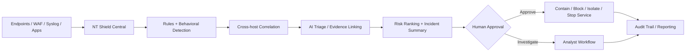
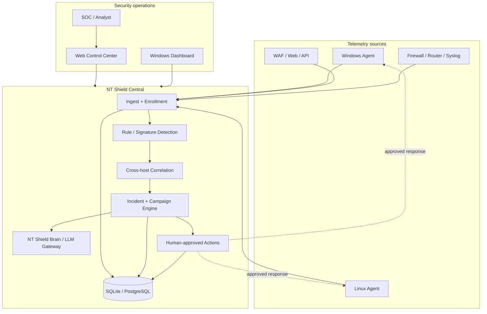
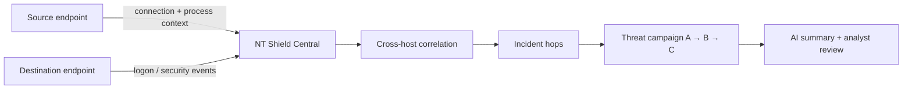
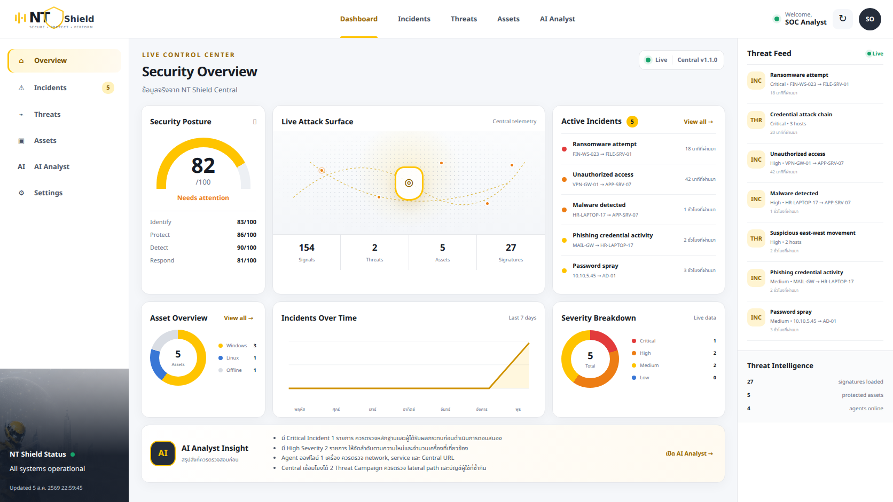
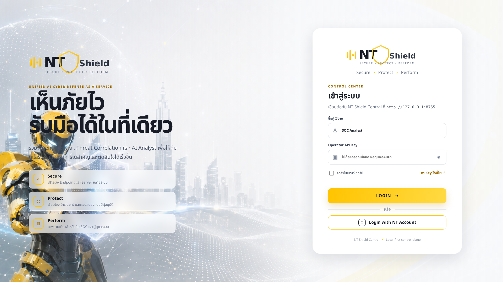
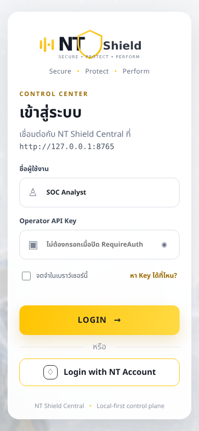

# NT Shield


## Unified AI Cyber Defense as a Service

**NT Shield** is an AI-assisted cyber defense platform that brings endpoint telemetry, infrastructure logs, cross-host correlation, AI triage, operator approval, response workflows, and a unified Control Center into one service-oriented security platform.

The current direction is no longer just “an endpoint agent with a dashboard.” NT Shield is designed as an **AI Scale-Out Layer for security operations**: collect signals from many systems, reduce alert noise, connect related evidence, explain incidents in analyst-friendly language, rank risk, and help an operator decide what to do next.

> **Positioning:** NT Shield is designed to **complement an existing SOC / MDR operation**, not replace experienced security analysts. In an NT service context, the intended model is **NT cyfence SOC + NT Shield AI Scale-Out Layer**, with AI handling high-volume triage and evidence correlation while important response actions remain governed by human approval.

**Current repository build target:** `1.1.0`

Windows Server **2012 → 2025** · Windows 10/11 · modern Linux distributions · CentOS 6 compatibility agent · responsive Web Control Center · native Windows Dashboard · OpenAI-compatible LLM Gateway.

---

## What problem NT Shield solves

Security teams rarely have a shortage of logs. They have a shortage of time.

A single organization may already generate security signals from:

- Website / WAF
- API gateways
- Windows and Linux servers
- Endpoint processes and services
- Firewall / router / network devices
- Authentication and identity systems
- Cloud and application workloads

Those signals normally arrive in different places, with different formats and different levels of context. NT Shield is designed to turn them into a smaller number of **investigable incidents** instead of forcing an analyst to manually connect hundreds or thousands of alerts.

### Core workflow



The safe default remains **IDS / detect-only**. Automated containment is optional. Remote response is operator-controlled.

---

## NT Shield in one sentence

> **NT Shield = unified telemetry + cross-host detection + AI triage + human-approved response + service-ready security operations.**

For an NT-oriented deployment model:

> **NT Shield = NT cyfence SOC + AI Scale-Out + Thai incident context + sovereign/local AI capability.**

---

## Platform capabilities

| Capability | What NT Shield does |
|---|---|
| **Endpoint telemetry** | Collects Windows/Linux security, process, service, network and system signals |
| **WAF / Syslog intake** | Brings infrastructure and application security events into the same control plane |
| **Cross-host correlation** | Links activity across endpoints into incidents and lateral-movement campaigns |
| **Behavior + rules** | Combines deterministic detection rules with behavioral context |
| **AI Analyst / Brain** | Uses Qwen-compatible or OpenAI-compatible inference endpoints for investigation assistance |
| **AI Triage** | Summarizes noisy evidence, links related observations and helps rank incident risk |
| **Human Approval** | Keeps important response actions under operator control |
| **Response workflow** | Supports approved actions such as blocking, isolation and service/process response where enabled |
| **Control Center** | Responsive Web UI plus native Windows dashboard for monitoring and operations |
| **LLM Gateway** | Central-issued expiring tokens and a constrained OpenAI-compatible proxy |
| **Offline resilience** | Local SQLite WAL queue with retry/backoff before telemetry reaches Central |
| **Audit-oriented design** | Centralizes actions and decisions so investigation/response history can be tracked |

---

## Current architecture



> Agents do not communicate directly with the Dashboard. Agents and operator interfaces communicate through **Central**.

---

## AI-assisted security operations

NT Shield Brain is intended to help analysts answer practical questions quickly:

- What happened?
- Which hosts, users, processes, services, IPs and ports are related?
- Is this one isolated alert or part of a larger campaign?
- What evidence supports the incident?
- What is the likely risk and why?
- What should the analyst investigate next?
- Which response actions are available?

The AI layer is an **assistant to the detection and response pipeline**, not the sole detection mechanism. Rules, telemetry, correlation and stored evidence remain important because an LLM confidently inventing a firewall incident would be a rather expensive feature.

### LLM Gateway

Agents and approved AI clients can use Central as their LLM endpoint. Central validates an expiring token, records usage and forwards only allowed inference routes to the configured upstream model service. The upstream API key is never returned to clients.

Example configuration:

```json
"LLMGateway": {
  "Enabled": true,
  "BaseUrl": "https://<MODEL-SERVER>/v1",
  "ApiKey": "<server-side-upstream-key>",
  "Model": "qwen3.5:9b",
  "SkipTlsVerify": false,
  "TimeoutSeconds": 120
}
```

Client configuration:

```env
OPENAI_BASE_URL=https://<CENTRAL>:7443/api/v1/llm/v1
OPENAI_API_KEY=ntllm_<issued-token>
```

Supported proxy routes include `models`, `chat/completions`, `completions`, and `embeddings`.

---

## Detection focus

NT Shield currently focuses on evidence-rich host and network behavior such as:

- Password spray and brute-force activity
- Suspicious successful logon after repeated failures
- Lateral movement and multi-host paths
- RDP / authentication-port fan-out
- Explicit credential use
- Privileged logon patterns
- Suspicious processes and command lines
- New Windows services and scheduled tasks
- Account / privilege changes
- WAF and syslog indicators
- Abnormal network activity
- Process/service attribution to network connections

The important part is not just producing an alert. NT Shield attempts to preserve the **host + user + process + service + IP + port + time + related incident** context an analyst needs for investigation.

See [`config/rules.json`](config/rules.json) and [`docs/threat-coverage.md`](docs/threat-coverage.md).

---

## Multi-host correlation



This is one of the core differentiators of the platform: a connection on one host and an authentication event on another can become part of the **same investigation**, rather than two unrelated rows in two unrelated dashboards.

---

## Human-approved response

NT Shield intentionally separates **detection** from **response authority**.

| Mode | Behavior |
|---|---|
| **IDS / Detect-only** | Detect, record and report. No automatic containment |
| **IPS** | Optional policy-controlled automatic response for configured severity/rules |
| **Operator response** | Action is requested centrally and delivered to the endpoint after approval |

Possible response actions depend on platform and policy, and may include blocking an IP, isolation, stopping a service or terminating a process.

---

## Service / AIaaS direction

NT Shield is being developed as a **service platform**, not only as software installed once and forgotten in a server rack until the person who installed it resigns.

The service model is designed around:

1. **Cloud/API delivery** — telemetry is sent to Central and insights are delivered through the Control Center/API.
2. **AI infrastructure abstraction** — customers use the service without managing the underlying LLM infrastructure.
3. **Tenant-oriented operations** — architecture is moving toward isolated customer/tenant investigation and centralized administration.
4. **Subscription + usage-based business model** — suitable for recurring managed-security services.
5. **Human governance** — AI can recommend and prioritize, while sensitive response actions remain approval-controlled.
6. **PDPA-aware data handling direction** — minimize unnecessary personal data exposure and support anonymization/redaction workflows in managed deployments.
7. **Scale-out operations** — use AI to reduce repetitive analyst triage so security operations can support more systems without linearly adding people.

Some service-layer capabilities are product direction and may evolve independently from the current `1.1.0` repository build. See the roadmap and documentation before treating a planned capability as production-ready.

---

## Control Center preview



The dashboard preview may use synthetic telemetry for visual validation. The shipped Control Center reads Central APIs and should not inject demo telemetry into normal operation.

| Desktop | Mobile |
|---|---|
|  |  |

---

## Build installers

The repository does not claim a universally validated prebuilt release for every supported operating system. Build version **1.1.0** from source and validate packages in the target environment before production deployment.

| File | Platform | Description |
|---|---|---|
| **NTShield-Setup-1.1.0.exe** | Windows | Central + Agent + Tray + native Dashboard + Web Control Center |
| **NTShield-Agent-Setup-1.1.0.exe** | Windows | Agent + Tray |
| **NTShield-Central-Setup-1.1.0.exe** | Windows | Central API + responsive Web Control Center |
| **NTShield-Linux-Agent-1.1.0-linux-x64.tar.gz** | Linux x64 | Linux agent package |

### Quick install

| Scenario | Steps |
|---|---|
| **One Windows server / lab** | Full Setup as Administrator → Full stack → `https://localhost:7443` |
| **Additional Windows endpoint** | Agent Setup → configure Central IP + port `7443` |
| **Linux host** | Install Linux package and point it to Central |
| **Silent Windows agent** | `NTShield-Agent-Setup-1.1.0.exe /VERYSILENT /ServerHost=10.0.0.5 /Port=7443` |

```bash
tar -xzf NTShield-Linux-Agent-1.1.0-linux-x64.tar.gz
cd NTShield-Linux-Agent-1.1.0-linux-x64
sudo ./install-agent.sh --host <CENTRAL_IP> --port 7443
```

Remote endpoints must use the Central server address, **not `localhost`**.

---

## Build from source

```powershell
dotnet restore
dotnet build NTShield.sln -c Release
dotnet test NTShield.sln -c Release

# Windows packages
.\installer\build-setup.ps1 -Version 1.1.0
.\installer\build-setup-agent.ps1 -Version 1.1.0
.\installer\build-setup-central.ps1 -Version 1.1.0

# Linux package
.\installer\build-agent-linux.ps1 -Version 1.1.0
```

---

## Technology stack

| Layer | Technology |
|---|---|
| Language | C# / **.NET 10** |
| Windows Agent | `net10.0-windows`, win-x64 self-contained service |
| Linux Agent | `net10.0`, linux-x64 self-contained, systemd |
| Local DB | SQLite WAL + offline queue |
| Central DB | SQLite default · PostgreSQL optional |
| UI | Responsive Web Control Center + WPF Dashboard + WinForms tray |
| Transport | HTTPS · optional mTLS · optional syslog UDP |
| Logging | Serilog rolling files |
| Installers | Inno Setup (Windows) · bash + tar.gz (Linux) |

---

## Central API overview

| Method | Path | Purpose |
|---|---|---|
| GET | `/api/v1/health` | Health + version information |
| POST | `/api/v1/agents/register` | Enroll agent |
| POST | `/api/v1/agents/heartbeat` | Presence + pending actions |
| GET | `/api/v1/agents` | Fleet inventory |
| POST | `/api/v1/ingest` | Telemetry ingest |
| GET/POST | `/api/v1/incidents` | Incident operations |
| POST/GET | `/api/v1/actions` | Operator response queue |
| GET | `/api/v1/threats` | Threat campaigns |
| GET | `/api/v1/threats/{id}/path` | Campaign hop path |
| GET | `/api/v1/signatures` | Loaded open-source signatures |
| UDP | `:5514` | Syslog intake |

---

## Repository structure

```text
NTShield.sln
├── src/
│   ├── NTShield.Agent
│   ├── NTShield.Agent.Tray
│   ├── NTShield.Agent.Linux
│   ├── NTShield.Server
│   ├── NTShield.Dashboard
│   ├── NTShield.Detection
│   ├── NTShield.Response
│   ├── NTShield.Collectors.Windows
│   ├── NTShield.Storage
│   ├── NTShield.Transport
│   └── NTShield.Shared
├── installer/
├── config/
├── docs/
└── tests/
```

---

## Documentation

| Document | Topic |
|---|---|
| [Architecture](docs/architecture.md) | Architecture and module flow |
| [Installation](docs/installation.md) | Deployment guide |
| [Detection rules](docs/detection-rules.md) | Rule engine |
| [Threat coverage](docs/threat-coverage.md) | Detection coverage |
| [IDS / IPS mode](docs/ids-ips-mode.md) | Detection vs response mode |
| [Syslog + signatures](docs/syslog-and-signatures.md) | Syslog intake and signatures |
| [Layered Antivirus](docs/antivirus.md) | Endpoint protection pipeline |
| [AI Realtime Console](docs/ai-console.md) | Brain/LLM status and evidence-grounded recommendations |
| [Incident response](docs/incident-response.md) | IR workflow |
| [Threat model](docs/threat-model.md) | Security assumptions |
| [Known limitations](docs/known-limitations.md) | Current limitations |
| [Windows Server 2012](docs/windows-server-2012.md) | Legacy Windows notes |

---

## Product roadmap

High-level direction:

- Stronger tenant foundation, roles, audit and policy isolation
- Broader agent enrollment and asset inventory
- Richer endpoint/network telemetry
- Behavioral detection and incident scoring
- Response policy and quarantine workflows
- Evidence timeline and process tree
- Topology / system canvas
- Reporting and managed-service views
- More XDR connectors
- PDPA-aware anonymization / redaction workflows
- Scale-out AI triage for SOC operations

See [`docs/roadmap-trellix-class.md`](docs/roadmap-trellix-class.md) for the implementation-oriented roadmap.

---

## Security principles

- Detect-only is the safe default.
- AI recommendations should be grounded in collected evidence.
- High-impact response should be policy-controlled and human-approved unless explicitly configured otherwise.
- Upstream model credentials stay on the server side.
- LLM access tokens are expiring and revocable.
- Production deployments should use trusted TLS certificates.
- Test and demo screenshots/data should use synthetic or anonymized information.

---

## What NT Shield does **not** claim

NT Shield does **not** claim that an LLM replaces a SOC analyst, that every planned AIaaS feature is production-complete in `1.1.0`, or that installing an agent magically turns an organization into an autonomous zero-day-proof fortress. Cybersecurity marketing has enough magic already.

The goal is more practical: **reduce investigation time, preserve evidence, correlate activity across systems, and help analysts respond consistently at scale.**

---

## License

Proprietary — NT Shield Team / internal use.

**Repository:** https://github.com/paddman/Shield  
**Releases:** https://github.com/paddman/Shield/releases
