# NT Shield


**Unified AI Cyber Defense as a Service** — endpoint agents, Central API, cross-host correlation, AI Analyst, responsive Web Control Center, and native Windows Dashboard in one repository.

Windows Server **2012 → 2025** · Windows 10/11 · modern Linux distributions · CentOS 6 compatibility agent · self-contained installers.

NT Shield detects **password spray, brute force, lateral movement, suspicious processes/services, WAF events, syslog indicators, and abnormal network activity**. It preserves the context analysts need: which host, user, process, Windows service, IP, port, and related incident were involved.

The safe default is **IDS / detect-only**. IPS containment and remote response remain optional and operator-controlled.

## Platform highlights

- **Central Control Center:** responsive login and live dashboard served directly by Central at `https://<CENTRAL>:7443/`.
- **Multi-platform fleet:** Windows Agent + Tray, Linux Agent, and a lightweight CentOS 6 Go agent.
- **Cross-host correlation:** joins endpoint events and connections into incidents and lateral-movement campaigns.
- **NT Shield Brain:** tenant-isolated AI investigation with Qwen-compatible endpoints and human approval guardrails.
- **WAF/syslog intake:** receives infrastructure and application security signals in the same control plane.
- **Offline resilience:** local SQLite WAL queue with retry/backoff before telemetry reaches Central.

## Control Center preview


The screenshots below are code-rendered desktop and mobile login previews. The dashboard preview uses synthetic telemetry for visual validation; the shipped Control Center reads live Central APIs and does not inject mock data.

| Desktop | Mobile |
|---|---|
|  |  |

---

## Build installers

This new repository does not claim a prebuilt release yet. Build version **1.1.0** from source into `artifacts/setup` and publish a GitHub Release only after validating the packages on the supported operating systems.

| File | Platform | Description | Size |
|------|----------|-------------|------|
| **NTShield-Setup-1.1.0.exe** | Windows | Central + Agent + Tray + native Dashboard + Web Control Center | Build-dependent |
| **NTShield-Agent-Setup-1.1.0.exe** | Windows | Agent + Tray | Build-dependent |
| **NTShield-Central-Setup-1.1.0.exe** | Windows | Central API + responsive Web Control Center | Build-dependent |
| **NTShield-Linux-Agent-1.1.0-linux-x64.tar.gz** | Linux x64 | Metrics + logs + auth + allowlisted remediation | Build-dependent |

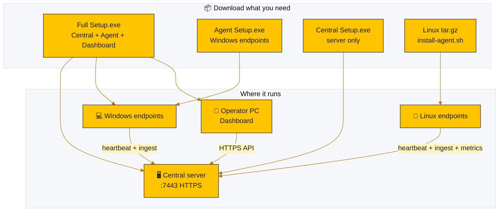

### Quick install

| Scenario | Steps |
|----------|--------|
| **One Windows server (lab/POC)** | Full Setup as Admin → **Full stack** → Dashboard `https://localhost:7443` |
| **Extra Windows PC** | Agent Setup → Central **IP** + port **7443** (not `localhost`) |
| **Linux host** | See bash block below |
| **Silent Windows agent** | `NTShield-Agent-Setup-1.1.0.exe /VERYSILENT /ServerHost=10.0.0.5 /Port=7443` |

```bash
# Linux (metrics + nginx/PHP/Docker/Node logs + allowlisted remediation)
tar -xzf NTShield-Linux-Agent-1.1.0-linux-x64.tar.gz
cd NTShield-Linux-Agent-1.1.0-linux-x64
sudo ./install-agent.sh --host <CENTRAL_IP> --port 7443
# status: cat /var/lib/ntshield/status.json
# docs: docs/linux-agent.md
```

---

## Big picture — system architecture

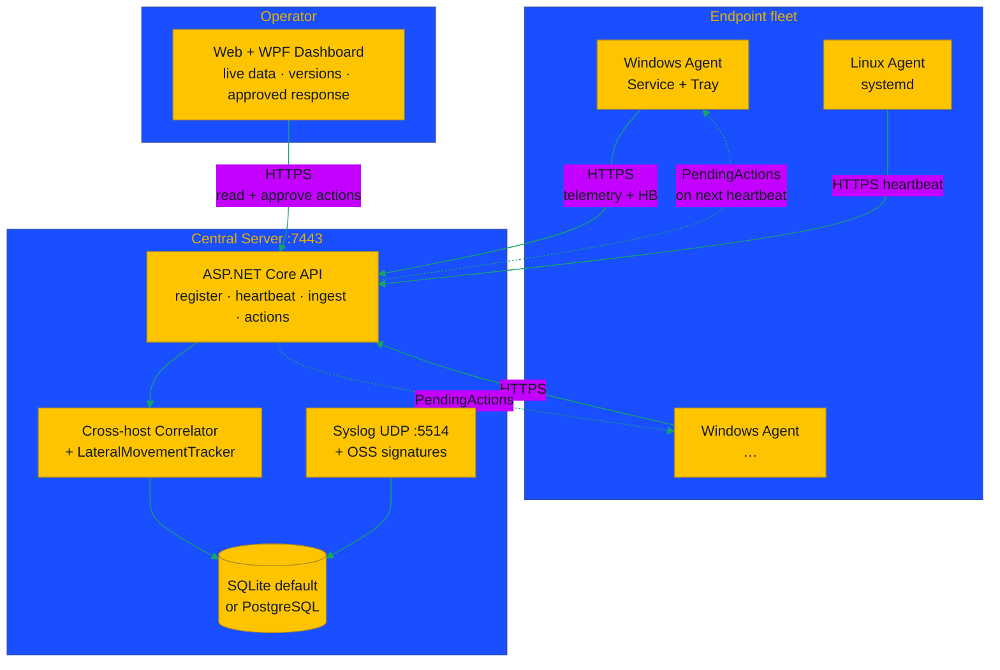

> **Important:** Agent never talks to Dashboard. Both talk to **Central**.
> Remote agents must use Central **IP:7443**, not `localhost`.

---

## Data flow — collection → detection → central → response

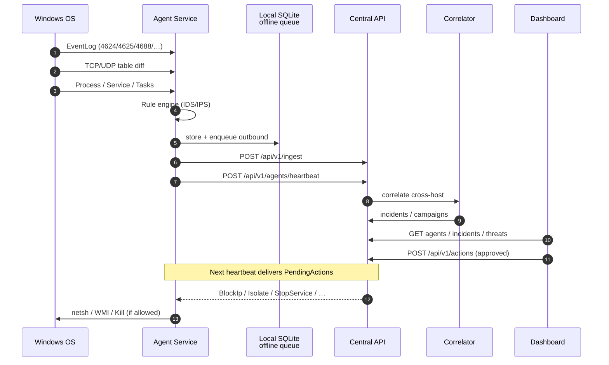

---

## Multi-host lateral path (what makes NT Shield distinctive)

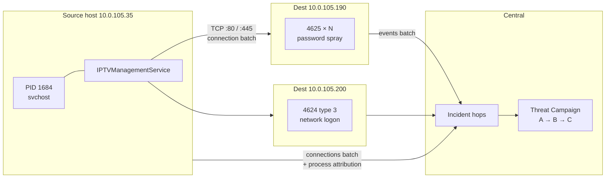

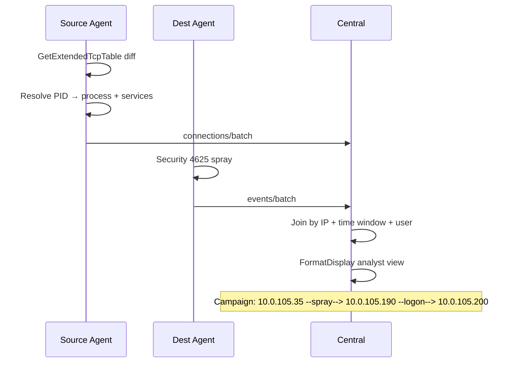

---

## Agent internals (Windows)

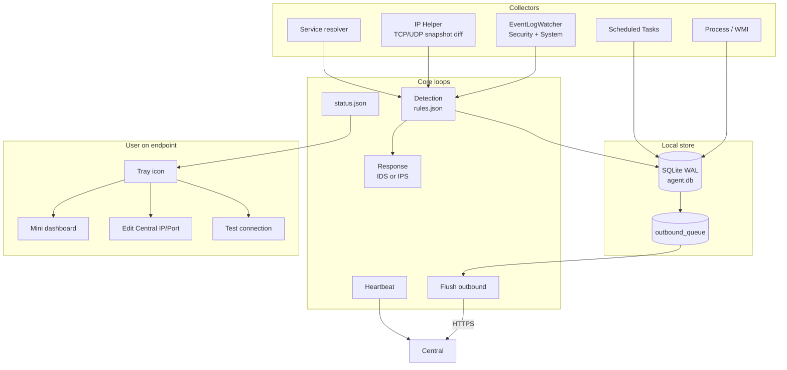

### IDS vs IPS mode

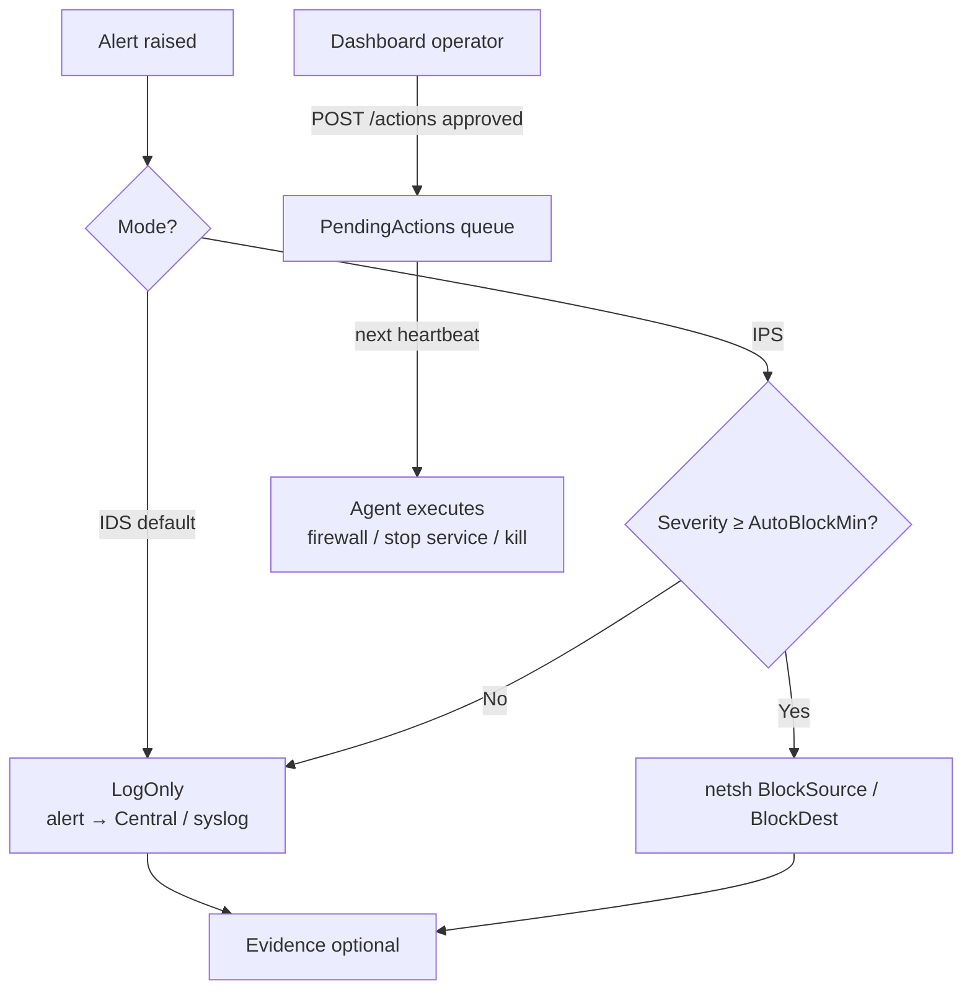

| Mode | Config | Behavior |
|------|--------|----------|
| **IDS** | `Agent:Mode=Ids` / `DetectOnly=true` | Detect + log; no auto contain |
| **IPS** | `Mode=Ips` / sample `config/appsettings.Ips.sample.json` | Auto-block High+ source/dest IP |
| **Operator** | Dashboard Firewall panel | Always via Central → agent heartbeat |

---

## Central internals

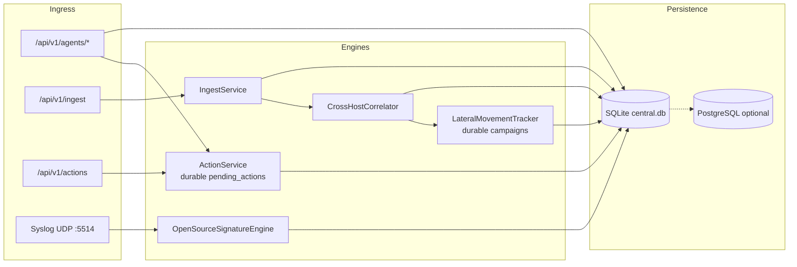

### Health & versions

```bash
curl -k https://localhost:7443/api/v1/health
# { "status":"ok", "product":"NT Shield Central", "version":"1.0.11", ... }

curl -k https://localhost:7443/api/v1/agents
# online, hostIp, centralUrl, agentVersion, platform, lastError
```

| Surface | Shows version |
|---------|----------------|
| Dashboard sidebar / Settings / title | Dashboard vX · Central vY |
| Agent heartbeat / Endpoints grid | `agentVersion` |
| Tray menu | `NT Shield Agent vX` |
| `CONNECTION.txt` | Central product version |
| `GET /api/v1/health` | `version` / `productVersion` |

---

## Dashboard map

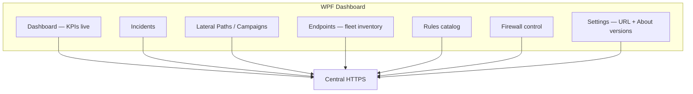

| Page | Data source |
|------|-------------|
| Dashboard | Live incidents / agents only — **no mock data** |
| Endpoints | `/api/v1/agents` (online/offline, OS, Central URL, last error) |
| Lateral Paths | `/api/v1/threats` + hop path |
| Firewall | `POST /api/v1/actions` → agent on next HB |
| Settings | Central URL + **About / Versions** |

---

## Deploy topology examples

### A) Lab — one machine

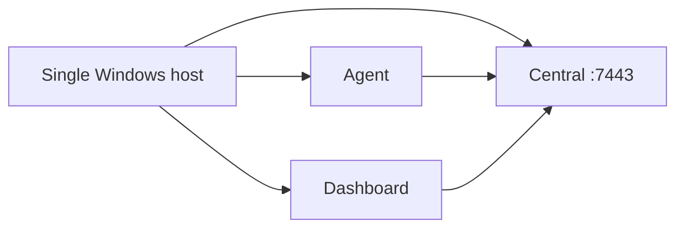

### B) Production-like — server + endpoints

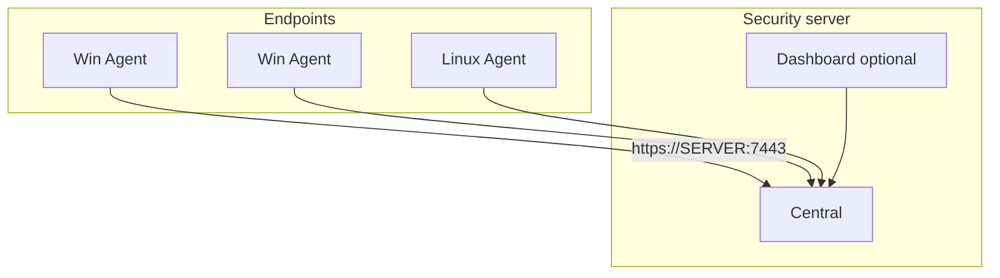

| Wrong | Right |
|-------|--------|
| Agent2 `Server.Url = https://localhost:7443` | `https://<Central-IP>:7443` |
| Dashboard different URL than Agent | **Same** Central base URL |
| Central stopped during install | Start Central first; open firewall TCP 7443 |

---

## Threat coverage (chart + table)

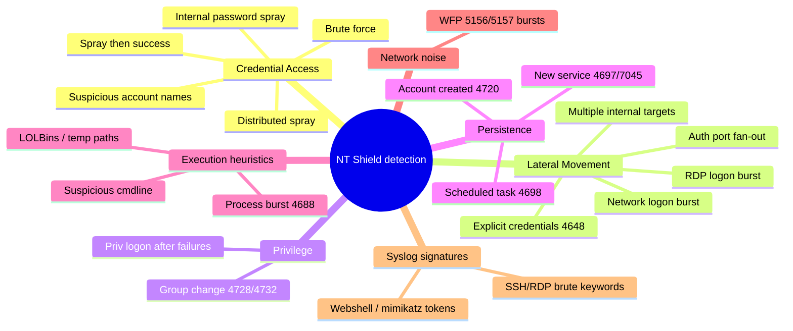

| Category | Example rule IDs | Primary signals |
|----------|------------------|-----------------|
| Credential Access | `INTERNAL_PASSWORD_SPRAY`, `BRUTE_FORCE_SINGLE_ACCOUNT` | 4625 volume / patterns |
| Lateral | `MULTIPLE_INTERNAL_TARGETS`, `RDP_LOGON_BURST` | TCP fan-out + logon types |
| Privilege | `PRIVILEGED_LOGON_AFTER_FAILURES` | 4625→4624 + 4672 |
| Persistence | `NEW_SERVICE_INSTALLED`, `SCHEDULED_TASK_CREATED` | 4697 / 7045 / 4698 |
| Full list | [`config/rules.json`](config/rules.json) · [`docs/threat-coverage.md`](docs/threat-coverage.md) | |

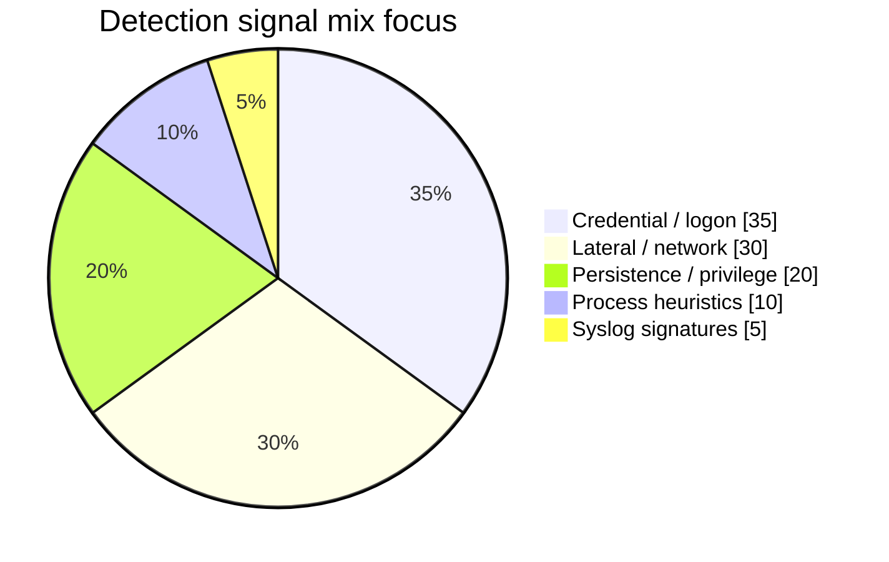

---

## API surface (Central)

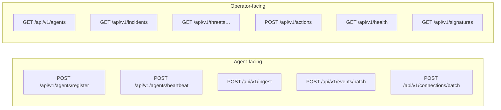

| Method | Path | Purpose |
|--------|------|---------|
| GET | `/api/v1/health` | Health + **version** + syslog info |
| POST | `/api/v1/agents/register` | Enroll agent |
| POST | `/api/v1/agents/heartbeat` | Presence + deliver pending actions |
| GET | `/api/v1/agents` | Fleet inventory |
| POST | `/api/v1/ingest` | Telemetry batch |
| GET/POST | `/api/v1/incidents` | Incidents |
| POST/GET | `/api/v1/actions` | Operator response queue |
| GET | `/api/v1/threats` · `/threats/{id}/path` | Campaigns / hops |
| GET | `/api/v1/signatures` | Loaded OSS signatures |
| UDP | `:5514` | Syslog → signature engine |

---

## Solution map (code)

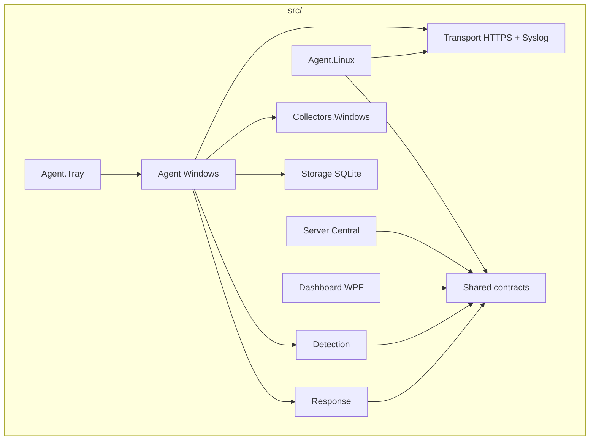

```
NTShield.sln
├── src/
│   ├── NTShield.Agent          # Windows service
│   ├── NTShield.Agent.Tray     # tray + mini UI + IP editor
│   ├── NTShield.Agent.Linux    # Linux client
│   ├── NTShield.Server         # Central API
│   ├── NTShield.Dashboard      # WPF SOC console
│   ├── NTShield.Detection
│   ├── NTShield.Response
│   ├── NTShield.Collectors.Windows
│   ├── NTShield.Storage
│   ├── NTShield.Transport
│   └── NTShield.Shared
├── installer/   # Inno Setup + linux/*.sh
├── config/      # rules.json · signatures · samples
├── docs/
└── tests/
```

---

## Stack

| Layer | Technology |
|-------|------------|
| Language | C# / **.NET 10** |
| Windows Agent | `net10.0-windows`, **win-x64 self-contained** service |
| Linux Agent | `net10.0`, **linux-x64 self-contained**, systemd — CPU/RAM/disk/net/I/O, multi-stack logs, remediation |
| Local DB | SQLite WAL + offline queue |
| Central DB | **SQLite default** · PostgreSQL optional |
| UI | Responsive Web Control Center + WPF Dashboard + WinForms tray |
| Transport | HTTPS · optional mTLS · optional syslog UDP |
| Logging | Serilog rolling files |
| Installers | Inno Setup (Windows) · bash + tar.gz (Linux) |

---

## Build from source

```powershell
cd C:\data_nt\Shield   # or your clone path
dotnet restore
dotnet build NTShield.sln -c Release
dotnet test NTShield.sln -c Release

# Windows packages
.\installer\build-setup.ps1 -Version 1.1.0          # Full
.\installer\build-setup-agent.ps1 -Version 1.1.0    # Agent
.\installer\build-setup-central.ps1 -Version 1.1.0  # Central

# Linux package (full metrics + logs + response)
.\installer\build-agent-linux.ps1 -Version 1.1.0
# → artifacts\setup\NTShield-Linux-Agent-1.1.0-linux-x64.tar.gz
```

### Publish agent only

```powershell
dotnet publish src/NTShield.Agent/NTShield.Agent.csproj `
  -c Release -r win-x64 --self-contained true `
  -p:PublishSingleFile=true `
  -p:IncludeNativeLibrariesForSelfExtract=true `
  -o artifacts/agent-win-x64
```

---

## Install paths (Windows)

| Item | Path |
|------|------|
| Agent service | `NTShieldAgent` |
| Central service | `NTShieldCentral` |
| Agent install | `C:\Program Files\NT Shield Agent` or `...\NT Shield\Agent` |
| Data | `C:\ProgramData\NTShield\` |
| Agent logs | `...\Agent\logs` · `status.json` |
| Central logs | `...\Server\logs` · `central.db` |

**Tray (Windows):** Edit Central IP/Port · Test connection · Mini dashboard · shows **version**.

**Linux:** `/opt/ntshield/agent` · `systemctl status ntshield-agent`

---

## Roadmap (high level)

```mermaid
timeline
  title NT Shield product roadmap
  section Phase 0
    Durable actions + fleet inventory + versions + Linux client : done
  section Phase 1
    Enrollment token + API auth + policy + audit : done (v1.0.13)
  section Phase 2
    Timeline + process tree + isolate + evidence : next
  section Phase 3
    Light EPP hash/quarantine : planned
  section Phase 4
    Full Linux collectors journald/ss/proc : planned
  section Later
    Scale · reports · XDR connectors : planned
```

Details: [`docs/roadmap-trellix-class.md`](docs/roadmap-trellix-class.md)

---

## Documentation

| Doc | Topic |
|-----|--------|
| [Architecture](docs/architecture.md) | Sequence + modules |
| [Installation](docs/installation.md) | Deploy guide |
| [Detection rules](docs/detection-rules.md) | Rule engine |
| [Threat coverage](docs/threat-coverage.md) | What we detect / track |
| [IDS / IPS mode](docs/ids-ips-mode.md) | Mode switch |
| [Syslog + signatures](docs/syslog-and-signatures.md) | UDP 5514 |
| [Layered Antivirus](docs/antivirus.md) | Windows Agent EPP pipeline |
| [Incident response](docs/incident-response.md) | IR workflow |
| [Threat model](docs/threat-model.md) | Security assumptions |
| [Known limitations](docs/known-limitations.md) | Honest limits |
| [Linux agent](installer/linux/README.md) | Linux install |
| [Windows Server 2012](docs/windows-server-2012.md) | Legacy OS notes |

---

## What NT Shield does **not** do

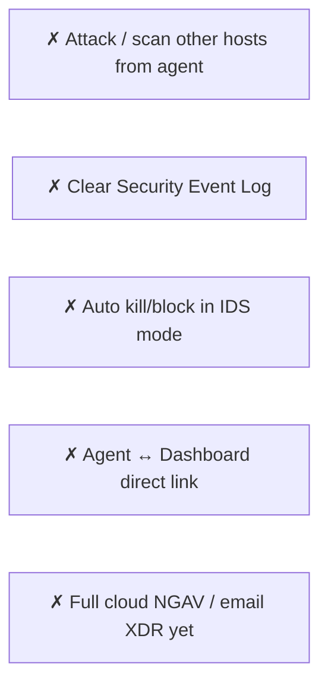

---

## License

Proprietary — NT Shield Team / internal use.

**Repo:** https://github.com/paddman/Shield
**Releases:** https://github.com/paddman/Shield/releases
