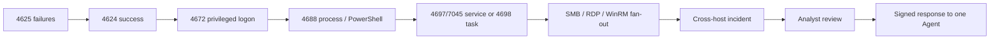
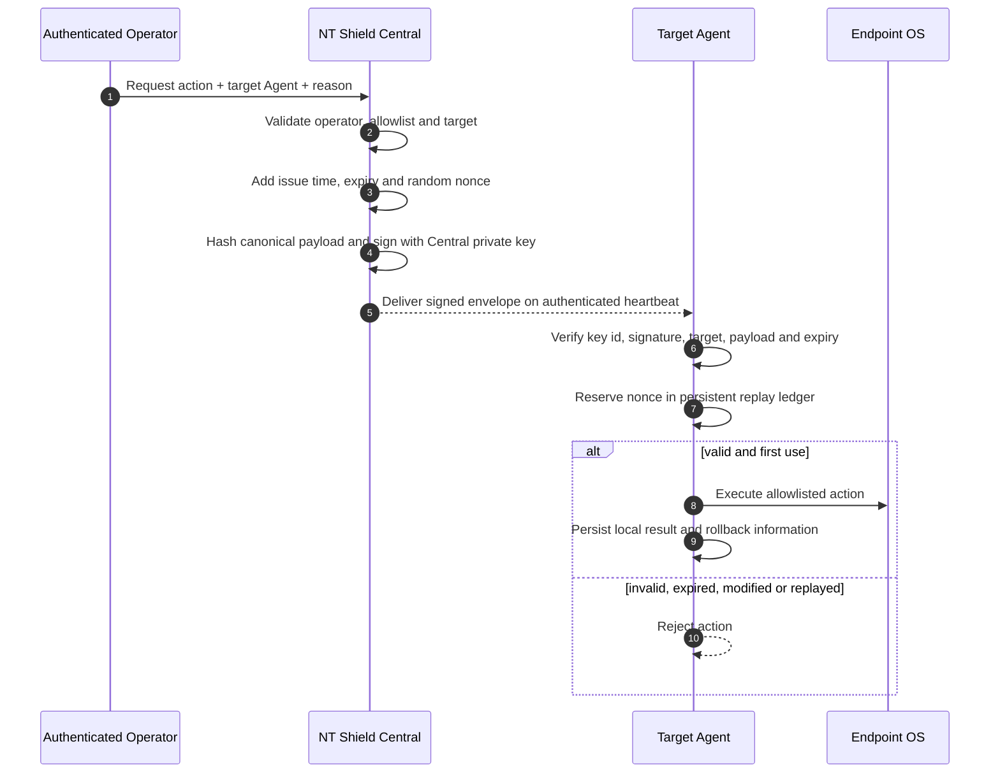
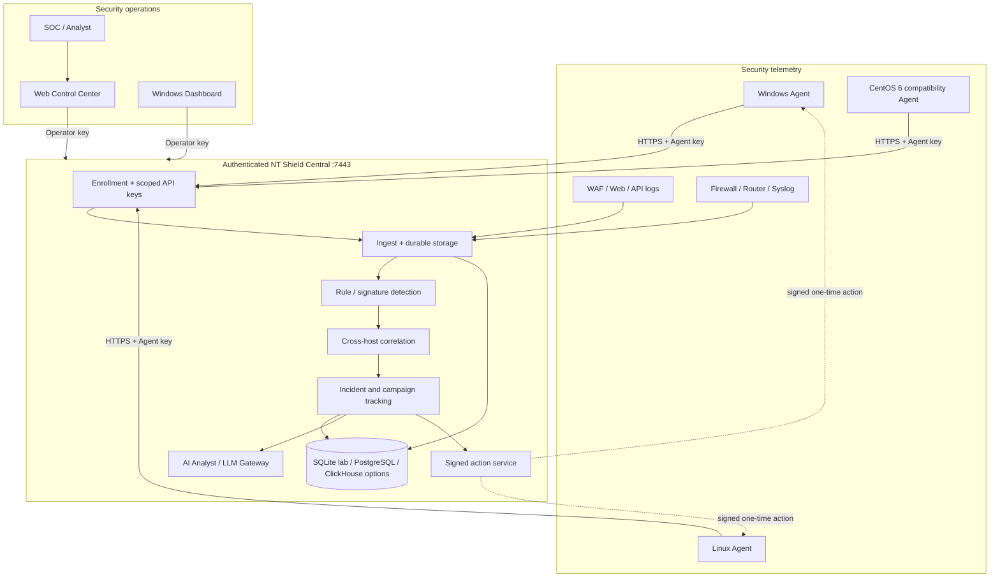
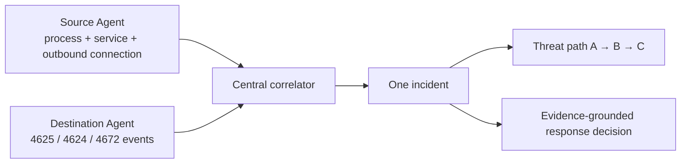

# NT Shield


## Credential Attack & Lateral Movement Defense for Windows and Linux Servers

[](Directory.Build.props)
[](docs/ids-ips-mode.md)
[](docs/security-auth-policy.md)

**NT Shield** is a defensive monitoring and response platform built to answer one practical security question:

> **When an attacker obtains or guesses an account, can we detect the chain across multiple servers, preserve the evidence, and contain the correct endpoint without turning the security platform itself into a remote-control vulnerability?**

NT Shield collects endpoint and infrastructure telemetry, detects credential abuse and suspicious execution, correlates evidence across hosts, creates an investigation-ready incident and delivers tightly controlled response actions through an authenticated Central control plane.

> **ภาษาไทย:** NT Shield เน้นตรวจจับการเดารหัสผ่าน บัญชีถูกยึด การยกระดับสิทธิ์ และการเคลื่อนย้ายจากเครื่องหนึ่งไปอีกเครื่อง พร้อมเชื่อมหลักฐานว่าเกี่ยวข้องกับผู้ใช้ Process, Service, IP, Port และ Server ใด ก่อนให้ผู้ปฏิบัติงานอนุมัติการตอบสนองที่มีลายเซ็นและระบุเครื่องเป้าหมายชัดเจน

**Current repository version:** `1.3.1`

Windows Server 2012 → 2025 · Windows 10/11 · modern Linux distributions · CentOS 6 compatibility telemetry agent · Web Control Center · native Windows Dashboard · local/OpenAI-compatible AI integration.

---

## The security problem

A real intrusion rarely appears as one perfect alert. It appears as fragments spread across machines and data sources:

```text
Many failed logons
        ↓
One successful logon
        ↓
Special privileges assigned
        ↓
PowerShell / service / scheduled task execution
        ↓
SMB, RDP or WinRM connection to another server
        ↓
A second host becomes involved
```

Without correlation, each step becomes a different row in a different console. An analyst must manually reconstruct the attack while the attacker continues moving.

NT Shield is designed to connect those fragments into one investigation:



The intended outcome is not “more alerts.” It is a smaller number of incidents that explain:

- which account and source IP were involved;
- which server accepted the logon;
- whether the logon became privileged;
- which process, executable hash or Windows service is related;
- where the process connected next;
- which evidence supports containment;
- which exact Agent may execute the approved response.

---

## What version 1.3.1 does

### Detection and evidence

| Security area | Current capability |
|---|---|
| **Credential attacks** | Password spray, distributed spray, brute force, failures followed by success and privileged-logon patterns |
| **Lateral movement** | Authentication-port fan-out, explicit credential use, RDP/network logon bursts and multi-host path tracking |
| **Execution** | Process creation, suspicious paths, LOLBins and suspicious command-line tokens |
| **Persistence** | New services, scheduled tasks, account creation and privileged group changes |
| **Endpoint file protection** | Defender/YARA-assisted scanning, hashes, heuristics, quarantine workflow and ransomware-style file activity sensors |
| **Infrastructure intake** | Syslog, WAF/web indicators and open-source signature matching |
| **Evidence context** | Host, user, process, service, IP, port, timestamp, event id, file hash and related incident where available |
| **Offline operation** | Local SQLite WAL queue with retry/backoff when Central is unavailable |

Detection definitions are visible in [`config/rules.json`](config/rules.json). Coverage and caveats are documented in [`docs/threat-coverage.md`](docs/threat-coverage.md) and [`docs/known-limitations.md`](docs/known-limitations.md).

### Response

The endpoint default is **IDS / Detect-Only**. Detection does not automatically grant response authority.

| Response path | Behavior |
|---|---|
| **IDS default** | Record and report; no automatic block, kill or isolation |
| **Local IPS** | Optional policy-controlled response for configured severity and rules |
| **Operator response** | Authenticated Central request, one concrete target Agent, signed approval envelope, expiry and one-time nonce |

Supported response types depend on platform and policy. The allowlist includes actions such as IP/port blocking, file scan/quarantine, service/task control, process termination, evidence export and constrained host quarantine. Arbitrary shell commands are not an Agent response API.

---

## The control plane is part of the security product

A monitoring Agent with process, service and firewall authority is itself a high-value target. Version `1.3.1` therefore changes the Central/Agent relationship from permissive lab behavior to **fail-closed defaults**.

### Enforced security boundaries

| Boundary | Enforcement in 1.3.1 |
|---|---|
| **Central API authentication** | `Security:RequireAuth=true` by default |
| **Operator isolation** | Operator APIs require `OperatorApiKey`; Agent keys are rejected outside Agent telemetry paths |
| **Agent identity** | First enrollment uses `EnrollmentToken`; Central issues a separate per-Agent API key |
| **Legacy mode** | `RequireAuth=false` never opens Operator APIs; anonymous ingest needs a second explicit lab-only switch |
| **Trusted transport** | Agents validate the Central certificate through OS trust or an explicit CA file; hostname mismatch is rejected |
| **Secret storage** | Enrollment, Operator and private action-signing keys stay in protected Central `secrets.json` |
| **No credentials in discovery metadata** | `connection.json` stores URL/port/CA metadata only |
| **No destructive broadcast** | Response actions require one concrete `TargetAgentId` |
| **Cryptographic approval** | Central signs destructive actions with RSA-PSS over a canonical payload hash |
| **Target binding** | An Agent rejects a validly signed action intended for another Agent |
| **Expiry** | Destructive actions have a short validity window, five minutes by default |
| **Replay protection** | Each Agent persists consumed nonces and rejects the same signed envelope after first use, including after restart |
| **Tamper resistance** | Changing the target, IP, port, process, path, service, reason or other signed field invalidates approval |

The complete design and acceptance checks are in [`docs/security-auth-policy.md`](docs/security-auth-policy.md).

### Signed response flow



The Central private signing key never leaves Central. Agents receive only the public verification key through versioned policy.

---

## Architecture



> Agents never communicate directly with the Dashboard. Agents and operator interfaces communicate through **Central** using different credentials and scopes.

---

## Cross-host investigation

NT Shield correlates destination authentication events with source-side network/process evidence when that evidence is available.



Example evidence set:

```text
Source       : 10.0.105.35 / SERVER-A
Process      : svchost.exe, PID 1684
Service      : suspicious-service
Destination  : 10.0.105.190 / SERVER-B, TCP 445
Events       : 4625 × 24 → 4624 → 4672
Next hop     : SERVER-B → SERVER-C over RDP/SMB
Decision     : block source, stop service or isolate target after review
```

This is the primary product direction. Generic dashboards and AI summaries are secondary to producing correct, attributable evidence for this chain.

---

## AI has a bounded role

NT Shield Brain and the LLM Gateway can help an analyst:

- summarize an incident in analyst-friendly language;
- connect referenced evidence;
- rank risk and explain contributing signals;
- search defensive playbooks;
- suggest the next read-only investigation step;
- draft a response recommendation.

AI does **not** create response authority. The security sequence is:

```text
Collected evidence
    → deterministic detection/correlation
    → risk context
    → AI explanation/recommendation
    → operator decision
    → Central-signed action
    → Agent verification and one-time execution
```

The investigation Agent is bounded to allowlisted read-only tools. It has no arbitrary shell, scanner or direct firewall mutation capability. A fluent paragraph from an LLM is not evidence, despite humanity's persistent urge to reward confident formatting.

### LLM Gateway

Central can proxy constrained OpenAI-compatible routes without exposing the upstream model key:

```json
"LLMGateway": {
  "Enabled": true,
  "BaseUrl": "https://<MODEL-SERVER>/v1",
  "ApiKey": "<server-side-secret>",
  "Model": "<approved-local-model>",
  "SkipTlsVerify": false,
  "TimeoutSeconds": 120
}
```

Client configuration:

```env
OPENAI_BASE_URL=https://<CENTRAL>:7443/api/v1/llm/v1
OPENAI_API_KEY=ntllm_<issued-expiring-token>
```

---

## Install and provision securely

The repository does not claim that one prebuilt binary has been validated on every listed OS. Build `1.3.1`, test it on the target golden image and retain a rollback package.

### Package names

| Package | Purpose |
|---|---|
| `NTShield-Setup-1.3.1.exe` | Full Windows stack: Central + Agent + Dashboard |
| `NTShield-Central-Setup-1.3.1.exe` | Authenticated Central + Web Control Center |
| `NTShield-Agent-Setup-1.3.1.exe` | Windows Agent + Tray |
| `NTShield-Linux-Agent-1.3.1-linux-x64.tar.gz` | Linux Agent + systemd installer |

### Build

```powershell
dotnet restore
dotnet build NTShield.sln -c Release
dotnet test NTShield.sln -c Release

.\installer\build-setup.ps1 -Version 1.3.1
.\installer\build-setup-central.ps1 -Version 1.3.1
.\installer\build-setup-agent.ps1 -Version 1.3.1
.\installer\build-agent-linux.ps1 -Version 1.3.1
```

### One-machine Windows lab

1. Run `NTShield-Setup-1.3.1.exe` as Administrator and select **Full stack**.
2. Central starts first, creates protected secrets and generates/exports its HTTPS certificate.
3. The bundled Agent trusts the local Central certificate, enrolls and receives its per-Agent key.
4. Read credentials as Administrator from:

```text
C:\ProgramData\NTShield\Server\secrets.json
```

5. Open:

```text
https://localhost:7443/
```

### Remote Windows Agent

Copy the public Central certificate to the endpoint, then install with the enrollment token. Do not copy `secrets.json` or the private PFX/signing key.

```powershell
NTShield-Agent-Setup-1.3.1.exe /VERYSILENT `
  /CentralUrl=https://shield.example.go.th:7443 `
  /EnrollmentToken=<ENROLLMENT_TOKEN> `
  /CaCertificatePath=C:\Secure\central.cer
```

For a publicly trusted certificate, `CaCertificatePath` may be omitted. The Central URL hostname must match the certificate SAN.

### Linux Agent

```bash
tar -xzf NTShield-Linux-Agent-1.3.1-linux-x64.tar.gz
cd NTShield-Linux-Agent-1.3.1-linux-x64

sudo ./install-agent.sh \
  --url https://shield.example.go.th:7443 \
  --ca-cert ./central-ca.crt \
  --enrollment-token '<ENROLLMENT_TOKEN>'

systemctl status ntshield-agent
journalctl -u ntshield-agent -f
```

The installer stores Linux Agent configuration with mode `0600` and enables a restricted systemd sandbox. `--allow-untrusted` exists only for an isolated migration lab.

### CentOS 6 compatibility Agent

The Go compatibility Agent supports metrics/log/WAF parsing, local spool and authenticated HTTPS transport suitable for legacy telemetry collection. It requires HTTPS/TLS 1.2 and should not be presented as feature-equivalent to the modern Windows/Linux response Agents.

---

## Central API boundary

| Method | Path | Principal | Purpose |
|---|---|---|---|
| GET | `/api/v1/health` | Public | Health and version only |
| POST | `/api/v1/agents/register` | Enrollment token | First Agent enrollment |
| POST | `/api/v1/agents/heartbeat` | Agent | Presence, policy and pending target-bound actions |
| POST | `/api/v1/ingest` | Agent | Telemetry ingest |
| POST | `/api/v1/events/batch` | Agent | Security-event batch |
| POST | `/api/v1/connections/batch` | Agent | Network-connection batch |
| GET | `/api/v1/agents` | Operator | Fleet inventory |
| GET | `/api/v1/incidents` | Operator | Incident list |
| POST | `/api/v1/actions` | Operator | Validate, sign and enqueue response action |
| GET/PUT | `/api/v1/policy` | Operator | Read/update endpoint policy |
| GET | `/api/v1/audit` | Operator | Security audit records |
| GET/POST/DELETE | `/api/v1/llm/tokens` | Operator | LLM token administration |
| GET/POST | `/api/v1/llm/v1/*` | LLM client token | Constrained model proxy |

Agent credentials are rejected on Operator routes.

---

## Tests that matter

The repository includes unit and integration tests for:

- password-spray and detection rules;
- lateral-movement correlation;
- offline queue behavior;
- endpoint scanning/quarantine;
- LLM gateway constraints;
- signed-action validity;
- payload tampering;
- expiry;
- target-Agent mismatch;
- plain `Approved=true` bypass attempts;
- nonce replay before and after Agent restart.

Tests demonstrate code behavior; they are not a substitute for attack simulation on a representative network. Production acceptance should measure MTTD, containment latency, false-positive rate, action success and rollback success.

---

## Current production boundary

| Area | Repository status |
|---|---|
| Authenticated Central and scoped Agent/Operator keys | Implemented |
| Trusted TLS and optional custom CA | Implemented |
| Signed, target-bound, expiring response actions | Implemented |
| Persistent one-time replay protection | Implemented |
| IDS endpoint collection and rule detection | Implemented |
| Cross-host correlation and threat paths | Implemented with scenario-dependent evidence |
| Named users, MFA and RBAC | Not yet implemented |
| End-to-end Central action result acknowledgement | Not yet complete |
| Durable state machine for every delayed multi-batch attack chain | Requires further implementation and validation |
| Database-enforced multi-tenant isolation | Requires PostgreSQL RLS/schema/database design |
| Kernel-grade ransomware prevention | Not claimed |
| Code-signed release enforcement | Available as policy hooks; release signing rollout required |
| Capacity/SLA numbers | Must be measured in the deployment environment |

Read [`docs/known-limitations.md`](docs/known-limitations.md) before any production claim or customer commitment.

---

## Repository structure

```text
NTShield.sln
├── src/
│   ├── NTShield.Agent              # Windows service
│   ├── NTShield.Agent.Tray         # tray + local status
│   ├── NTShield.Agent.Linux        # modern Linux Agent
│   ├── NTShield.Agent.CentOS6      # legacy compatibility Agent
│   ├── NTShield.Server             # authenticated Central API + Web UI
│   ├── NTShield.Dashboard          # WPF operator console
│   ├── NTShield.Detection          # endpoint rules
│   ├── NTShield.Response           # allowlisted response execution
│   ├── NTShield.Collectors.Windows
│   ├── NTShield.Storage
│   ├── NTShield.Transport
│   └── NTShield.Shared
├── ai-service/                      # bounded investigation / AI analysis service
├── config/                          # rules, allowlists, protection/signature packs
├── installer/                       # Windows and Linux packaging
├── docs/
└── tests/
```

---

## Documentation

| Document | Purpose |
|---|---|
| [Security authentication and signed actions](docs/security-auth-policy.md) | P0 control-plane boundary and acceptance tests |
| [Known limitations](docs/known-limitations.md) | Honest production gaps |
| [Architecture](docs/architecture.md) | Component flow |
| [Installation](docs/installation.md) | Deployment details |
| [Detection rules](docs/detection-rules.md) | Rule engine |
| [Threat coverage](docs/threat-coverage.md) | Signals and ATT&CK mapping |
| [IDS / IPS mode](docs/ids-ips-mode.md) | Detection and response authority |
| [Incident response](docs/incident-response.md) | Response workflow |
| [Threat model](docs/threat-model.md) | Assumptions and abuse cases |
| [Layered endpoint protection](docs/antivirus.md) | Defender/YARA/user-mode file pipeline |
| [AI security design](docs/ntshield-brain-ai.md) | Evidence-grounded and bounded AI workflow |
| [Implementation readiness](docs/ntshield-readiness.md) | Implemented vs pilot validation |
| [Windows Server 2012](docs/windows-server-2012.md) | Legacy Windows notes |

---

## What NT Shield does not claim

NT Shield does not claim to be:

- a replacement for experienced SOC analysts;
- a complete commercial NGAV/EDR engine;
- a kernel-level ransomware prevention product;
- proof that every zero-day will be detected;
- a fully validated multi-tenant MDR platform merely because a tenant id exists;
- secure when TLS verification, authentication or secret-file permissions are deliberately disabled;
- production-ready on an OS that has not passed installation, attack, rollback and upgrade testing.

The intended deployment model is to **augment an existing SOC/MDR operation** by collecting endpoint evidence, correlating attack chains, reducing repetitive triage and executing explicitly governed defensive actions.

---

## License

Proprietary — NT Shield Team / internal use.

**Repository:** `paddman/Shield`  
**Version:** `1.3.1`
