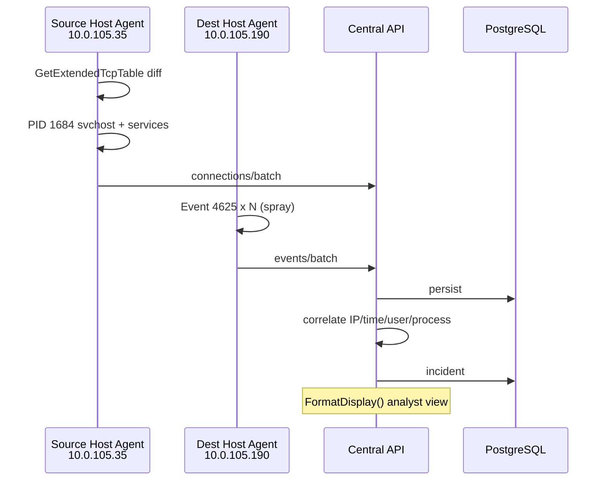

# Architecture

## Agent modules

1. Event Log Collector — real-time + bookmark
2. Network Collector — IP Helper snapshot diff
3. Process / Service / Scheduled Task collectors
4. SQLite storage + offline queue + DPAPI
5. Detection engine (JSON rules)
6. Response engine (detect-only default, allowlist, approval)
7. Evidence packager (ZIP + SHA-256 manifest)
8. HTTPS transport (mTLS optional, backoff, idempotency)

## Incident output fields

Source / Destination / Port / Process / PID / Services / Service account /
Logon process / Logon type / Failed attempts / Distinct usernames /
Successful login detected / First-Last seen / Evidence events
