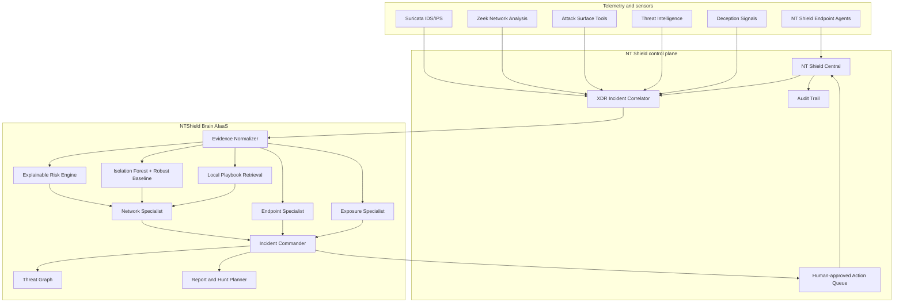

# NT Shield Brain: Sovereign AI-XDR and SOC-as-a-Service

## Product position

NT Shield Brain is the AI intelligence layer above the existing security stack:

- NT Shield Windows/Linux Agent for endpoint events, processes, services, metrics and response
- NT Shield Central for enrollment, policy, correlation, incidents, action queue and audit
- Suricata for IDS/IPS signatures and packet-level alerts
- Zeek for connection, DNS, HTTP, TLS, notice and protocol-anomaly context
- App Attribution for DNS/SNI/port/ASN recognition of remote-access, tunnel and messaging applications
- ASM tools such as subfinder, amass, naabu, nmap, httpx and nuclei
- PCAP capture, replay and evidence export
- monthly security reporting

The AI layer does not replace these deterministic systems. It correlates and explains their evidence, learns per-asset behavior, recommends guarded response actions and exposes the result as a multi-tenant API service.



## Core AI pipeline

### 1. Evidence normalization

Each source is converted to a bounded `EvidenceItem` with a stable `ref_id`. The model receives only normalized evidence, not unrestricted files or shell access.

Examples:

```text
incident:demo-credential-001
win:41001
suricata:2210051:0
zeek:C-demo-445:0
asm:nuclei:2:ab12cd34ef56
intel:0:8f90ab12cd34
```

Every AI citation is checked against this set. Unknown references are removed. If the model returns no valid citation, the deterministic risk engine supplies citations from actual input evidence.

### 2. Explainable deterministic risk

The deterministic engine anchors the decision using signals such as:

- failed-authentication volume and distinct usernames
- success after failures
- privileged logon
- suspicious process and command context
- remote-access/tunneling applications
- Suricata severity and alert count
- Zeek protocol anomalies
- reconnaissance fan-out
- critical ASM exposure
- malicious threat-intelligence verdicts
- deception hits
- tenant/asset anomaly score

The LLM can refine the assessment but its final risk score is constrained to a bounded range around the deterministic result. A deception hit enforces a critical floor.

### 3. Behavioral ML

The ML service stores numerical observations by `tenant_id + asset_id`. After the learning threshold it combines:

- Isolation Forest for multi-dimensional outliers
- robust median absolute deviation for explainable per-feature deviation

Strong outliers are not automatically learned back into the baseline. This reduces a simple baseline-poisoning failure mode.

Recommended features:

```text
connections_per_minute
unique_destination_ports
unique_destination_ips
failed_login_count_5m
distinct_username_count
successful_login_after_failures
rare_process_score
dns_query_entropy
outbound_bytes_deviation
new_service_count
remote_access_app_score
```

### 4. Local playbook retrieval

Defensive Markdown playbooks are retrieved locally with TF-IDF. The model receives relevant response guidance without sending organizational telemetry to an external provider.

Initial playbooks cover:

- credential attacks
- lateral movement
- web compromise
- reconnaissance
- tunneling and remote access
- deception tripwires

### 5. Multi-agent analysis

When `NTSHIELD_ANALYSIS_MODE=multi_agent`, three specialist calls run concurrently:

| Specialist | Primary evidence |
|---|---|
| Network | Suricata, Zeek, network threat intelligence |
| Endpoint | NT Shield incident, Windows events, process/service context, deception |
| Exposure | ASM findings and exposure-related intelligence |

The Incident Commander then synthesizes one decision. This is not an uncontrolled autonomous agent swarm. Every specialist has read-only evidence, a strict JSON contract, no arbitrary tools and no ability to execute response actions.

Use `single` mode for lower latency.

### 6. Guarded response recommendations

The model may recommend only a fixed action allowlist. It cannot invent a new command. Actions such as blocking, rate-limiting, isolation, quarantine, service stop, process termination, account lock and session revocation always become:

```json
{
  "requires_human_approval": true
}
```

Non-destructive actions such as bounded PCAP capture, threat-intelligence enrichment, diagnostics, evidence export, ticket creation and notification may be automated according to tenant policy.

The existing NT Shield Central action queue remains the enforcement boundary.

## Integration with the existing Suricata/Zeek web system

The existing dashboard can call one endpoint after it creates or updates an XDR incident:

```http
POST /v1/incidents/analyze
X-NTShield-Tenant: <tenant>
X-NTShield-Api-Key: <key>
Content-Type: application/json
```

Suggested mapping:

| Existing screen/data | AI request field |
|---|---|
| Active Incidents | incident core fields |
| Top Risk Hosts | `features` and asset context |
| Suricata alert | `suricataAlerts[]` |
| Zeek table | `zeekEvents[]` |
| App Attribution | Zeek/raw evidence plus application/risk attributes |
| Threat Intel chips | `threatIntel[]` |
| PCAP evidence | `rawEvidence[]` references, not unrestricted file content |
| ASM findings | `asmFindings[]` |
| Endpoint process/service | incident process, service and evidence fields |

Persist the returned `analysis_id`, `risk_score`, `summary_th`, evidence citations, threat graph and recommendations beside the incident. The dashboard should show an **AI evidence drawer**, not just a decorative paragraph.

Recommended UI blocks:

1. **NTShield Brain verdict**: classification, risk, confidence, model/fallback state.
2. **Why this score**: deterministic and anomaly contributions.
3. **Evidence**: clickable citations that navigate to Suricata, Zeek, endpoint or ASM source data.
4. **Attack graph**: host/IP/user/process/service/domain/exposure relationships.
5. **Specialists**: Network, Endpoint and Exposure summaries.
6. **Response gate**: action, target, evidence and Approve/Reject.
7. **Unknowns**: facts the AI explicitly could not establish.

## Integration with NT Shield Central

No .NET change is required for the first demo. Configure each AI tenant with its NT Shield Central URL and operator API key, then call:

```http
POST /v1/central/incidents/{incident_id}/analyze
```

NTShield Brain fetches `/api/v1/incidents/{id}`, analyzes it and stores the decision under the same tenant. This is intentionally server-configured rather than caller-supplied to prevent arbitrary URL fetching.

The next .NET integration should add:

```text
POST /api/v1/incidents/{id}/ai/analyze
GET  /api/v1/incidents/{id}/ai
POST /api/v1/incidents/{id}/ai/actions/{actionId}/approve
POST /api/v1/incidents/{id}/ai/feedback
```

NT Shield Central should remain responsible for RBAC, action execution and durable operator audit.

## Integration with the monthly report system

Call `POST /v1/reports/monthly` with measured values only:

```json
{
  "month": "2026-08",
  "organizationName": "Demo Organization",
  "metrics": {
    "total_incidents": 81,
    "critical_incidents": 3,
    "closed_incidents": 74,
    "mttd_seconds": 18,
    "mttr_minutes": 11
  },
  "topIncidents": [],
  "responseActions": [],
  "asmFindings": [],
  "complianceFrameworks": ["ISO27001", "NIST-CSF", "SOC2"]
}
```

The model is instructed not to invent events, percentages or improvements. Compliance mappings are evidence indexes, not an automatic certification claim. An auditor remains stubbornly human, as bureaucracy intended.


## Silent Hunter deception engine

NTShield Brain includes a defensive token registry for canary credentials, honey files, decoy API keys, decoy URLs and shares. The raw secret is returned only at creation. The database stores only its SHA-256 hash.

A valid hit is deduplicated, recorded and converted into a critical incident with a deception evidence reference. The risk engine enforces a critical floor, while containment still requires operator approval. The public hit endpoint treats the token as a bearer secret and does not reveal whether an invalid token exists.

This is useful because a properly placed decoy has a far lower benign-use rate than ordinary IDS signatures. It does not magically guarantee zero false positives, because backup crawlers and overeager scanners remain capable of touching things they were told not to touch.

## AIaaS and MSP design

Tenant isolation is enforced by API key and every durable table includes `tenant_id`. Each tenant can define:

- its own API key
- NT Shield Central URL and operator key
- certificate verification policy
- model gateway in a later dedicated deployment profile
- retention and usage quota in the service control plane

Current usage endpoint:

```http
GET /v1/usage/2026-08
```

It reports analysis count, model-call count, prompt/completion tokens and fallback analyses. This supports internal cost allocation and future service plans.

## Responsible AI controls

| Risk | Control |
|---|---|
| Hallucinated evidence | Exact `ref_id` validation |
| Prompt injection in logs | Logs are marked untrusted data; no tool execution |
| Dangerous action | Fixed action enum and mandatory human approval |
| Cross-tenant data leak | Tenant-scoped auth and storage queries |
| SSRF through Central bridge | Central URL is server-side tenant configuration |
| Model outage | Deterministic analysis fallback |
| Baseline poisoning | Strong outliers are not learned automatically |
| Unbounded payload | Item, character and request-size limits |
| Silent model drift | Feedback, model name, token usage and audit are stored |
| Unsupported compliance claim | Mappings are evidence aids and require auditor review |

## Hackathon demo sequence

1. ASM finds an exposed service on the authorized lab server.
2. A controlled test generates reconnaissance or credential attack activity.
3. Suricata creates an IDS alert.
4. Zeek supplies DNS/TLS/connection context.
5. NT Shield Agent identifies host, user, process, PID and service.
6. Existing XDR correlation creates one incident.
7. NTShield Brain runs deterministic risk, ML baseline, playbook retrieval and specialists.
8. The dashboard shows one evidence-grounded verdict and attack graph.
9. AI recommends bounded PCAP capture and a destructive containment action.
10. Operator approves containment; NT Shield Central executes and audits it.
11. The monthly report endpoint creates executive, technical and compliance-evidence summaries.

## Performance expectations for Qwen 3.5 9B

For the demo, keep normalized evidence under roughly 80,000 characters and disable model thinking. Multi-agent mode produces four model calls, with three specialists concurrent. If latency is too high, switch to `single` while keeping the same deterministic, ML, RAG and guardrail layers.

Measure rather than invent:

- event-to-incident latency
- AI analysis latency
- analyst triage time before/after
- valid evidence-citation rate
- precision on controlled scenarios
- false-positive reduction after baseline learning
- response completion and audit success
- model fallback rate
